# Legal Document Demystifier - Use Case Diagram

```mermaid
graph TB
    %% Actors
    User[👤 End User<br/>Individual/Business Owner<br/>Tenant/Borrower/Employee]
    GeminiAI[🤖 Google Gemini AI]
    FileSystem[📁 File System]

    %% Main System Boundary
    subgraph "Legal Document Demystifier System"
        %% Input Use Cases
        UC1[📤 Upload Document<br/>PDF/TXT/DOCX]
        UC2[📝 Paste Text<br/>Direct Input]
        UC3[⚙️ Configure Analysis<br/>Document Type<br/>User Role<br/>Complexity Level]
        
        %% Core Processing
        UC4[🔍 Analyze Legal Document<br/>• Extract text from files<br/>• Generate AI analysis<br/>• Parse JSON response<br/>• Handle errors]
        
        %% Results and Interaction
        UC5[📊 View Analysis Results<br/>• Document summary<br/>• Key points<br/>• Risk identification<br/>• Recommendations<br/>• Simplified explanations]
        
        UC6[❓ Ask Follow-up Questions<br/>• Input specific questions<br/>• Get contextual answers<br/>• View relevant sections<br/>• See confidence levels]
        
        %% Session Management
        UC7[💬 Manage Chat History<br/>• View past Q&A sessions<br/>• Reuse previous questions<br/>• Clear chat history]
        
        UC8[🔄 Reset Session<br/>• Clear current analysis<br/>• Reset form fields<br/>• Start over]
        
        %% Health Check
        UC9[❤️ Health Check<br/>System status]
    end

    %% User interactions
    User -.->|uploads| UC1
    User -.->|pastes| UC2
    User -.->|configures| UC3
    User -.->|initiates| UC4
    User -.->|views| UC5
    User -.->|asks| UC6
    User -.->|manages| UC7
    User -.->|resets| UC8

    %% System relationships
    UC1 -->|includes| UC4
    UC2 -->|includes| UC4
    UC3 -->|configures| UC4
    UC4 -->|produces| UC5
    UC5 -.->|extends| UC6
    UC6 -->|updates| UC7
    UC4 -.->|interacts with| GeminiAI
    UC4 -.->|uses| FileSystem

    %% External system interactions
    GeminiAI -.->|provides analysis| UC4
    GeminiAI -.->|answers questions| UC6
    FileSystem -.->|stores temporarily| UC4

    %% Styling
    classDef actor fill:#e1f5fe,stroke:#01579b,stroke-width:2px
    classDef usecase fill:#f3e5f5,stroke:#4a148c,stroke-width:2px
    classDef system fill:#e8f5e8,stroke:#1b5e20,stroke-width:2px
    classDef primary fill:#fff3e0,stroke:#e65100,stroke-width:3px

    class User,GeminiAI,FileSystem actor
    class UC1,UC2,UC3,UC5,UC6,UC7,UC8,UC9 usecase
    class UC4 primary
```



## Detailed Use Case Specifications

### Primary Use Cases

#### UC4: Analyze Legal Document
- **Actor**: End User
- **Description**: Core functionality to analyze legal documents using AI
- **Preconditions**: User has document (file or text) to analyze
- **Main Success Scenario**:
  1. User provides document (upload or paste)
  2. User configures analysis options
  3. System extracts text from document
  4. System sends text to Gemini AI for analysis
  5. System parses AI response into structured format
  6. System displays analysis results
- **Extensions**: 
  - File upload fails → Show error message
  - AI analysis fails → Show fallback response
  - JSON parsing fails → Show unstructured response
- **Includes**: Extract Text, Call AI API, Parse Response

#### UC6: Ask Follow-up Questions
- **Actor**: End User  
- **Description**: Interactive Q&A about the analyzed document
- **Preconditions**: Document has been analyzed successfully
- **Main Success Scenario**:
  1. User enters specific question
  2. System sends question + document context to AI
  3. System receives structured answer
  4. System displays answer with relevant sections
  5. System saves Q&A to chat history
- **Extensions**:
  - No document context → Use provided text
  - AI response fails → Show error message

### Supporting Use Cases

#### UC7: Manage Chat History
- **Actor**: End User
- **Description**: Manage previous Q&A interactions
- **Main Success Scenario**:
  1. System displays list of previous questions/answers
  2. User can click to reuse previous questions
  3. User can clear entire chat history
- **Extensions**: No history available → Show empty state

#### UC8: Reset Session  
- **Actor**: End User
- **Description**: Clear current session and start fresh
- **Main Success Scenario**:
  1. User clicks reset button
  2. System clears all form fields
  3. System hides analysis results
  4. System returns to initial state

## System Architecture Flow


## Actor Descriptions

### End User Types:
- **Individual/Consumer**: Regular person analyzing personal contracts
- **Business Owner**: Small business reviewing agreements
- **Tenant**: Person analyzing rental agreements
- **Borrower**: Individual reviewing loan documents
- **Employee**: Worker analyzing employment contracts

### External Systems:
- **Google Gemini AI**: Provides document analysis and Q&A capabilities
- **File System**: Temporary storage for uploaded documents and chat history

## GCP Architecture Diagram

```mermaid
graph TB
    %% User Layer
    subgraph "Users"
        U1[👤 Individual Users]
        U2[🏢 Business Users]
        U3[🏠 Tenants]
        U4[💰 Borrowers]
    end

    %% Internet Gateway
    Internet[🌐 Internet]
    
    %% GCP Infrastructure
    subgraph "Google Cloud Platform"
        %% Load Balancing & Security
        subgraph "Network & Security Layer"
            LB[⚖️ Cloud Load Balancer<br/>HTTPS/SSL Termination]
            CDN[🚀 Cloud CDN<br/>Static Assets]
            IAM[🔐 Identity & Access Management<br/>API Key Management]
            Firewall[🛡️ VPC Firewall<br/>Security Rules]
        end

        %% Compute Layer
        subgraph "Compute Layer"
            subgraph "Cloud Run Services"
                CR1[🐳 Legal Demystifier<br/>FastAPI Application<br/>Auto-scaling Containers]
                CR2[🔄 Health Check Service<br/>Monitoring Endpoint]
            end
            
            subgraph "Alternative: App Engine"
                AE[🚀 App Engine<br/>Python Runtime<br/>(Alternative Deployment)]
            end
        end

        %% AI & ML Services
        subgraph "AI/ML Services"
            Gemini[🤖 Gemini AI API<br/>Document Analysis<br/>Question Answering<br/>JSON Response Generation]
            
            subgraph "Optional AI Enhancements"
                AutoML[🎯 AutoML<br/>Custom Model Training]
                Translate[🌍 Translation API<br/>Multi-language Support]
                NLP[📝 Natural Language API<br/>Sentiment Analysis]
            end
        end

        %% Storage Layer
        subgraph "Storage & Data"
            subgraph "Temporary Storage"
                Memory[💾 In-Memory Storage<br/>Session Data<br/>Document Cache]
                CloudStorage[☁️ Cloud Storage<br/>Temporary File Storage<br/>(Optional)]
            end
            
            subgraph "Optional Persistent Storage"
                Firestore[🗄️ Firestore<br/>User Sessions<br/>Chat History<br/>Analytics]
                BigQuery[📊 BigQuery<br/>Usage Analytics<br/>Document Insights]
            end
        end

        %% Monitoring & Operations
        subgraph "Operations & Monitoring"
            Logging[📋 Cloud Logging<br/>Application Logs<br/>Error Tracking]
            Monitoring[📈 Cloud Monitoring<br/>Performance Metrics<br/>Alerts]
            Trace[🔍 Cloud Trace<br/>Request Tracing<br/>Latency Analysis]
            ErrorReporting[⚠️ Error Reporting<br/>Exception Tracking]
        end

        %% Build & Deploy
        subgraph "CI/CD Pipeline"
            CloudBuild[🔨 Cloud Build<br/>Automated Builds<br/>Container Registry]
            Artifacts[📦 Artifact Registry<br/>Container Images<br/>Dependencies]
            Scheduler[⏰ Cloud Scheduler<br/>Periodic Tasks<br/>(Optional)]
        end
    end

    %% External Dependencies
    subgraph "External Services"
        GitHub[💻 GitHub<br/>Source Code<br/>Version Control]
        PyPI[🐍 PyPI<br/>Python Packages<br/>Dependencies]
    end

    %% User Flow
    U1 --> Internet
    U2 --> Internet
    U3 --> Internet
    U4 --> Internet
    
    Internet --> LB
    LB --> CDN
    LB --> CR1
    CDN --> CloudStorage
    
    %% Application Flow
    CR1 --> IAM
    CR1 --> Gemini
    CR1 --> Memory
    CR1 --> CloudStorage
    CR1 --> Firestore
    CR1 --> Logging
    
    %% AI Processing
    Gemini --> AutoML
    Gemini --> Translate
    Gemini --> NLP
    
    %% Monitoring Flow
    CR1 --> Monitoring
    CR1 --> Trace
    CR1 --> ErrorReporting
    Logging --> BigQuery
    
    %% Build Flow
    GitHub --> CloudBuild
    CloudBuild --> Artifacts
    Artifacts --> CR1
    PyPI --> CloudBuild
    
    %% Health Monitoring
    CR2 --> Monitoring
    CR2 --> CR1
    
    %% Security Flow
    Firewall --> CR1
    IAM --> Gemini
    
    %% Optional Enhancement Flows
    Scheduler -.-> CR1
    AE -.-> Gemini
    AE -.-> Firestore

    %% Styling
    classDef user fill:#e3f2fd,stroke:#1976d2,stroke-width:2px
    classDef network fill:#f3e5f5,stroke:#7b1fa2,stroke-width:2px
    classDef compute fill:#e8f5e8,stroke:#388e3c,stroke-width:2px
    classDef ai fill:#fff3e0,stroke:#f57c00,stroke-width:2px
    classDef storage fill:#fce4ec,stroke:#c2185b,stroke-width:2px
    classDef monitoring fill:#e0f2f1,stroke:#00695c,stroke-width:2px
    classDef cicd fill:#f1f8e9,stroke:#558b2f,stroke-width:2px
    classDef external fill:#fafafa,stroke:#616161,stroke-width:2px
    classDef optional fill:#fff8e1,stroke:#ff8f00,stroke-width:1px,stroke-dasharray: 5 5

    class U1,U2,U3,U4 user
    class LB,CDN,IAM,Firewall network
    class CR1,CR2,AE compute
    class Gemini,AutoML,Translate,NLP ai
    class Memory,CloudStorage,Firestore,BigQuery storage
    class Logging,Monitoring,Trace,ErrorReporting monitoring
    class CloudBuild,Artifacts,Scheduler cicd
    class GitHub,PyPI,Internet external
    class AutoML,Translate,NLP,AE,CloudStorage,Firestore,BigQuery,Scheduler optional
```

## GCP Deployment Options

### Option 1: Cloud Run (Recommended)


### Option 2: App Engine Deployment


## Cost Optimization Architecture

```mermaid
graph TB
    subgraph "Cost-Optimized GCP Architecture"
        %% Minimal Setup
        LB2[Cloud Load Balancer<br/>$18/month]
        CR3[Cloud Run<br/>Pay-per-request<br/>~$5-20/month]
        Gemini2[Gemini AI<br/>Pay-per-token<br/>~$10-50/month]
        
        %% Optional Add-ons
        CDN2[Cloud CDN<br/>~$5/month<br/>(Optional)]
        Logging2[Cloud Logging<br/>~$2/month<br/>(Optional)]
        Monitoring2[Cloud Monitoring<br/>Free tier<br/>(Optional)]
        
        LB2 --> CR3
        CR3 --> Gemini2
        CR3 -.-> CDN2
        CR3 -.-> Logging2
        CR3 -.-> Monitoring2
    end
    
    subgraph "Estimated Monthly Costs"
        Basic[Basic Setup: $35-90/month]
        Enhanced[Enhanced Setup: $50-120/month]
        Enterprise[Enterprise Setup: $200-500/month]
    end
    
    classDef cost fill:#c8e6c9,stroke:#2e7d32,stroke-width:2px
    classDef estimate fill:#ffecb3,stroke:#f57c00,stroke-width:2px
    
    class LB2,CR3,Gemini2,CDN2,Logging2,Monitoring2 cost
    class Basic,Enhanced,Enterprise estimate
```

## Security Architecture


## PlantUML Use Case Diagram

```plantuml
@startuml Legal_Document_Demystifier_Use_Cases

!theme aws-orange
skinparam backgroundColor #f8f9fa
skinparam handwritten false
skinparam monochrome false
skinparam packageStyle rectangle
skinparam usecaseBackgroundColor #e3f2fd
skinparam usecaseBorderColor #1976d2
skinparam actorBackgroundColor #fff3e0
skinparam actorBorderColor #f57c00
skinparam rectangleBackgroundColor #f3e5f5
skinparam rectangleBorderColor #7b1fa2

title Legal Document Demystifier - Use Case Diagram

' Actors
actor "Individual User" as Individual #lightblue
actor "Business Owner" as Business #lightgreen  
actor "Tenant" as Tenant #lightyellow
actor "Borrower" as Borrower #lightcyan
actor "Employee" as Employee #lightpink

' External Systems
actor "Google Gemini AI" as GeminiAI #orange
actor "File System" as FileSystem #gray

' System boundary
rectangle "Legal Document Demystifier System" as System {
  
  ' Primary Use Cases
  usecase "Upload Document\n(PDF/TXT/DOCX)" as UC1 #lightblue
  usecase "Paste Text\n(Direct Input)" as UC2 #lightblue
  usecase "Configure Analysis\n(Type/Role/Complexity)" as UC3 #lightgreen
  
  ' Core Processing
  usecase "Analyze Legal Document" as UC4 #gold
  note right of UC4
    • Extract text from files
    • Generate AI analysis  
    • Parse JSON response
    • Handle errors
  end note
  
  ' Results and Interaction
  usecase "View Analysis Results" as UC5 #lightcyan
  note right of UC5
    • Document summary
    • Key points extraction
    • Risk identification
    • Recommendations
    • Simplified explanations
  end note
  
  usecase "Ask Follow-up Questions" as UC6 #lightgreen
  note right of UC6
    • Input specific questions
    • Get contextual answers
    • View relevant sections
    • See confidence levels
  end note
  
  ' Session Management
  usecase "Manage Chat History" as UC7 #lightyellow
  note right of UC7
    • View past Q&A sessions
    • Reuse previous questions
    • Clear chat history
  end note
  
  usecase "Reset Session" as UC8 #lightpink
  usecase "Health Check" as UC9 #lightgray
  
  ' Sub-use cases (included)
  usecase "Extract Text from PDF" as SUB1 #white
  usecase "Call AI API" as SUB2 #white
  usecase "Parse JSON Response" as SUB3 #white
  usecase "Store Document Temporarily" as SUB4 #white
  usecase "Save to Chat History" as SUB5 #white
}

' User Relationships
Individual --> UC1 : uploads
Individual --> UC2 : pastes text
Individual --> UC3 : configures
Individual --> UC4 : initiates analysis
Individual --> UC5 : views results
Individual --> UC6 : asks questions
Individual --> UC7 : manages history
Individual --> UC8 : resets session

Business --> UC1
Business --> UC2  
Business --> UC3
Business --> UC4
Business --> UC5
Business --> UC6
Business --> UC7
Business --> UC8

Tenant --> UC1
Tenant --> UC2
Tenant --> UC3  
Tenant --> UC4
Tenant --> UC5
Tenant --> UC6
Tenant --> UC7
Tenant --> UC8

Borrower --> UC1
Borrower --> UC2
Borrower --> UC3
Borrower --> UC4
Borrower --> UC5
Borrower --> UC6
Borrower --> UC7
Borrower --> UC8

Employee --> UC1
Employee --> UC2
Employee --> UC3
Employee --> UC4
Employee --> UC5
Employee --> UC6
Employee --> UC7
Employee --> UC8

' System Relationships
UC1 .> UC4 : <<include>>
UC2 .> UC4 : <<include>>
UC3 ..> UC4 : <<configure>>
UC4 --> UC5 : produces
UC5 ..> UC6 : <<extend>>
UC6 --> UC7 : updates

' Include relationships for UC4
UC4 .> SUB1 : <<include>>
UC4 .> SUB2 : <<include>>  
UC4 .> SUB3 : <<include>>
UC4 .> SUB4 : <<include>>

' Include relationship for UC6
UC6 .> SUB5 : <<include>>

' External System Relationships
UC4 --> GeminiAI : interacts with
UC6 --> GeminiAI : queries
UC4 --> FileSystem : uses
SUB4 --> FileSystem : stores in
SUB5 --> FileSystem : saves to

' Admin/System relationships
UC9 --> Individual : provides status
UC9 --> Business : provides status
UC9 --> Tenant : provides status
UC9 --> Borrower : provides status
UC9 --> Employee : provides status

@enduml
```



## PlantUML Sequence Diagram - Document Analysis Flow

```plantuml
@startuml Document_Analysis_Sequence

!theme aws-orange
skinparam backgroundColor #f8f9fa
skinparam sequenceParticipant underline

title Legal Document Analysis - Sequence Diagram

actor "End User" as User
participant "Frontend\n(JavaScript)" as Frontend
participant "FastAPI\nBackend" as Backend  
participant "Text Extractor" as Extractor
participant "Gemini AI" as AI
participant "JSON Parser" as Parser
participant "Document Storage" as Storage

== Document Upload & Analysis ==

User -> Frontend: Upload document + configuration
activate Frontend

Frontend -> Backend: POST /analyze-document
activate Backend

Backend -> Extractor: Extract text from file
activate Extractor
Extractor -> Extractor: Process PDF/TXT/DOCX
Extractor --> Backend: Return extracted text
deactivate Extractor

Backend -> AI: Send analysis prompt + text
activate AI
note right: Prompt includes:\n• Document type\n• User role\n• Complexity level
AI --> Backend: Return AI analysis (JSON)
deactivate AI

Backend -> Parser: Parse AI response
activate Parser
Parser -> Parser: Extract JSON from response
Parser -> Parser: Validate structure
alt JSON parsing successful
    Parser --> Backend: Structured analysis data
else JSON parsing failed
    Parser --> Backend: Fallback response
end
deactivate Parser

Backend -> Storage: Store document temporarily
activate Storage
Storage --> Backend: Document ID generated
deactivate Storage

Backend --> Frontend: Return analysis results
deactivate Backend

Frontend -> Frontend: Render analysis UI
Frontend --> User: Display structured results
deactivate Frontend

== Follow-up Questions ==

User -> Frontend: Ask question about document
activate Frontend

Frontend -> Backend: POST /ask-question
activate Backend

Backend -> Storage: Retrieve document context
activate Storage
Storage --> Backend: Document text
deactivate Storage

Backend -> AI: Send question + context
activate AI
AI --> Backend: Return answer + sections
deactivate AI

Backend -> Parser: Parse Q&A response
activate Parser
Parser --> Backend: Structured answer
deactivate Parser

Backend -> Storage: Save to chat history
activate Storage
Storage --> Backend: Chat saved
deactivate Storage

Backend --> Frontend: Return answer + metadata
deactivate Backend

Frontend -> Frontend: Render Q&A result
Frontend --> User: Display answer + confidence
deactivate Frontend

@enduml
```



## PlantUML Component Diagram - System Architecture

```plantuml
@startuml System_Architecture_Components

!theme aws-orange
skinparam backgroundColor #f8f9fa
skinparam component {
  BackgroundColor #e3f2fd
  BorderColor #1976d2
  ArrowColor #1976d2
}

title Legal Document Demystifier - Component Architecture

package "Frontend Layer" {
  [Web Interface] as WebUI
  [JavaScript App] as JSApp
  [File Upload Handler] as FileHandler
  [Chat Interface] as ChatUI
}

package "API Layer" {
  [FastAPI Application] as FastAPI
  [Route Handlers] as Routes
  [Request Validation] as Validation
  [Response Formatting] as ResponseFormat
}

package "Business Logic Layer" {
  [Document Analyzer] as Analyzer
  [Text Extractor] as TextExtract
  [AI Prompt Builder] as PromptBuilder
  [JSON Parser] as JSONParser
  [Session Manager] as SessionMgr
}

package "External Services" {
  [Google Gemini AI] as GeminiAI
  [PDF Processing] as PDFProc
  [File System] as FileSystem
}

package "Data Layer" {
  [Document Storage] as DocStorage
  [Chat History] as ChatHistory
  [Session Cache] as SessionCache
}

package "Infrastructure" {
  [Health Check] as Health
  [Error Handler] as ErrorHandler
  [Logging Service] as Logger
}

' Frontend connections
WebUI --> JSApp
JSApp --> FileHandler
JSApp --> ChatUI
JSApp --> FastAPI : HTTP/REST

' API Layer connections  
FastAPI --> Routes
Routes --> Validation
Routes --> ResponseFormat
Routes --> Analyzer

' Business Logic connections
Analyzer --> TextExtract
Analyzer --> PromptBuilder
Analyzer --> JSONParser
Analyzer --> SessionMgr
TextExtract --> PDFProc
PromptBuilder --> GeminiAI
JSONParser <-- GeminiAI

' Data Layer connections
SessionMgr --> DocStorage
SessionMgr --> ChatHistory
SessionMgr --> SessionCache
DocStorage --> FileSystem

' Infrastructure connections
FastAPI --> Health
FastAPI --> ErrorHandler
FastAPI --> Logger

' External service connections
GeminiAI ..> Logger : logs API calls
PDFProc ..> Logger : logs processing
ErrorHandler ..> Logger : logs errors

note right of GeminiAI
  • Document analysis
  • Question answering
  • JSON response generation
  • Rate limiting & error handling
end note

note right of DocStorage
  • Temporary document storage
  • Session-based cleanup
  • Memory-only processing
  • No persistent user data
end note

@enduml
```



## PlantUML Activity Diagram - Document Processing Flow


